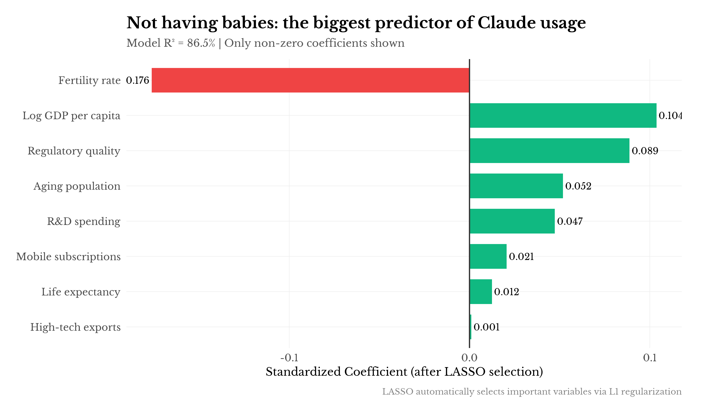

# What Predicts Claude Usage Across Countries? Some Curious Patterns

Anthropic recently released their Economic Index—a genuinely interesting dataset on how people use Claude across 166 countries. I spent a weekend playing with the data and found some patterns that surprised me.

## The obvious stuff first

The report itself notes that Claude usage correlates with GDP, internet access, and institutional quality. No shock there. Rich countries with good infrastructure use AI products more. Development economics 101.

But here's what bugged me: all these variables are correlated with *each other*. High-GDP countries have better governance. Better governance correlates with R&D spending. R&D spending correlates with education. And so on. Classic multicollinearity problem.

So which factors actually matter independently? You can't answer that by just running correlations.

## LASSO to the rescue

I threw 19 country-level variables into a LASSO regression—GDP, internet access, education, governance indicators, demographics, the works. For those unfamiliar, LASSO is basically a method that forces the model to pick winners. Variables that don't add independent predictive power get their coefficients shrunk to exactly zero.

The model kept six variables. Here's what survived:

**Fertility rate came out on top.** Coefficient of -0.18, standardized. Countries where people have fewer kids use Claude more, controlling for everything else.

I'll admit I didn't expect this. GDP and regulatory quality are in there too (makes sense), along with aging population, R&D spending, and life expectancy. But fertility is the strongest single predictor.

What got dropped? Internet access. Tertiary education. Corruption control. These are correlated with the winners but don't add independent explanatory power once you control for the core demographic and institutional factors.

The model explains about 87% of variance with a cross-validated R² of 83%. Not bad for country-level social science data.

## Who's punching above their weight?

Looking at the residuals—countries that use Claude more or less than the model predicts—some interesting patterns emerge.

Israel leads global usage by a wide margin. Singapore and the Anglophone countries (Australia, New Zealand, Canada, UK) all exceed predictions. Small wealthy places with high human capital and (mostly) English as a working language.

Meanwhile, large emerging markets underperform. India, Indonesia, Brazil—despite big tech sectors and young populations—sit lower than you'd expect from their economic profiles.

## The survey data tells a different story

This got me curious about perception vs. reality. BCG ran a survey in 2023 asking people across 21 countries whether they use ChatGPT. I merged this with the Claude usage data.

The correlation is negative. r = -0.43.

India tops the self-reported charts at 45% claiming ChatGPT usage. Their actual Claude usage per capita is near the bottom. Indonesia, Brazil, South Africa—same pattern. High claimed adoption, low revealed preference.

Australia, South Korea, the US, and UK show the opposite: modest survey responses, high actual usage.

I'm not sure what to make of this. Part of it is probably ChatGPT vs. Claude market share differences. Part might be survey response bias—there's a literature on over-reporting of socially desirable behaviors in certain cultural contexts. But the magnitude of the gap is striking.

## The attitude paradox

One more puzzle. Ipsos surveys people on whether they feel "excited" or "nervous" about AI. I expected excitement to correlate with adoption.

It doesn't. The relationship is strongly negative (r = -0.58).

Thailand: 80% excited about AI. Near the bottom of Claude usage.
Australia: 40% excited, 69% nervous. Near the top of usage.

The pattern holds across the board. Countries with the most AI anxiety are the heaviest users. Countries most enthusiastic about AI's promise aren't actually using it much.

This probably isn't causal in either direction. It's a confounder story: wealthy, educated populations in mature economies tend to be both (a) more skeptical of new technologies and (b) better positioned to access them. The skeptics have the credit cards and the infrastructure. The enthusiasts don't.

## Rich countries augment, poor countries automate

This one surprised me most. The AEI data includes whether each conversation is "automation" (replacing human work) or "augmentation" (enhancing human work). I expected this to be roughly constant across countries. It's not.

The correlation between GDP and automation is **-0.83**. That's huge.

Pakistan, Brazil, and Rwanda have the highest automation rates (~63%). Users there are asking Claude to do things *for* them—write the code, draft the document, complete the task.

Japan, Norway, and Denmark have the highest augmentation rates (~56%). Users there are asking Claude to help them do things *better*—explain concepts, review their work, suggest improvements.

The interpretation writes itself: in labor-abundant economies, the marginal value of AI is replacing expensive skilled labor. In labor-scarce, high-wage economies, the value is making existing workers more productive. Labor economics 101, manifesting in LLM usage patterns.

## How people talk to Claude varies dramatically

The data includes collaboration styles—how users structure their interactions. Again, I expected noise. Again, there's signal.

**Brazil and Indonesia are highly directive.** Over 50% of Brazilian conversations are one-shot commands: "do this." Minimal back-and-forth. Get the output, move on.

**Japan and Taiwan are highly learning-oriented.** Nearly 28% of Japanese conversations are about understanding rather than doing. "Explain this. Help me learn. Why does this work?"

**Turkey and India are highly iterative.** Lots of feedback loops and task refinement. Building toward something over multiple exchanges.

I don't want to over-interpret cultural patterns from usage data, but the variation is large enough to matter for product design. A Claude interface optimized for directive one-shot usage looks different from one optimized for iterative co-development.

## The overperformers are interesting

Looking at which countries use Claude more than GDP would predict (the positive residuals from a simple log-log regression):

| Country | GDP/capita | Residual |
|---------|------------|----------|
| Georgia | $14,463 | +0.59 |
| Nepal | $2,250 | +0.52 |
| Sri Lanka | $6,856 | +0.51 |
| Armenia | $12,551 | +0.49 |
| Ukraine | $7,490 | +0.44 |
| Moldova | $11,854 | +0.41 |

There's a pattern here: post-Soviet states with strong technical education, South Asian countries with large English-speaking tech diasporas, and small countries with outsized digital infrastructure investments.

The underperformers are also telling: oil states (Qatar, Kuwait, Saudi Arabia) and countries with restricted internet access (Turkmenistan is the biggest underperformer by far).

## What I think this means

A few tentative conclusions:

**Demographics matter more than I expected.** The fertility/aging story is real and persists across specifications. Older, shrinking populations adopt AI tools at higher rates. The automation/augmentation split reinforces this: labor-scarce rich countries augment, labor-abundant poor countries automate. Classic factor substitution, playing out in real-time LLM usage.

**How countries use AI differs as much as whether they use it.** The collaboration style differences are striking. Japan's learning-oriented usage vs. Brazil's directive usage suggests fundamentally different mental models of what an AI assistant is for. Product implications are non-trivial.

**Survey data on AI adoption should be treated skeptically.** The gap between claimed and revealed behavior is large enough to matter for policy and market analysis.

**Attitudes don't predict behavior here.** At least not in the simple way you'd expect. Being excited about AI doesn't translate to using it, at the country level. Access and infrastructure dominate.

**The overperformers share a profile.** Small countries, post-Soviet technical education legacy, English-speaking diasporas, or unusual digital infrastructure investments. Georgia, Armenia, Nepal, Sri Lanka, Ukraine. Worth watching.

**English proficiency probably matters** but I couldn't test it rigorously—the data coverage is spotty. The Anglophone overperformance is suggestive though.

---

Anyway, this was a fun dataset to dig into. Anthropic deserves credit for releasing it—there's not much public data on actual AI usage patterns at this granularity. Would be curious to see this updated over time as adoption evolves.

*Code and data on GitHub. Methods: LASSO and elastic net regression with 10-fold CV, 103 countries with complete data. Main data sources: Anthropic Economic Index, World Bank WDI, Ipsos AI Monitor 2024, BCG Global Consumer Survey 2023.*
